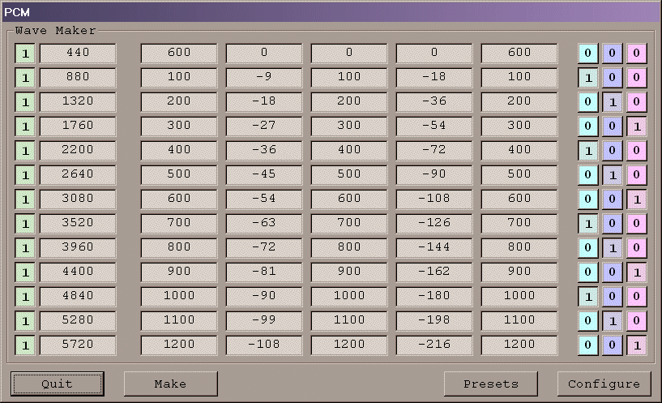



## PcmRiffADSR

### Description

PcmRiffADSR (upgraded PcmRiff project with ADSR envelope capabilities) generates and mixes Sine Wave based data to produce a standard Type 1 Riff File (.WAV) in either 8-bit, 16-bit or 24-bit bandwidths at just about any sample rate. The files generated are standard files that can be used with any application, including samplers or sounds for your PC. Complete and extensive demo project included. This variation on the original PcmRiff code includes the addition of an envelope generator for more dynamic sound shapes. Package also includes the original PcmRiff project.
 
### More Info
 

             |
---                |---
**Submitted On**   |2002-04-06 18:56:38
**By**             |[Urthman](https://github.com/Planet-Source-Code/PSCIndex/blob/master/ByAuthor/urthman.md)
**Level**          |Intermediate
**User Rating**    |5.0 (20 globes from 4 users)
**Compatibility**  |VB 5\.0, VB 6\.0
**Category**       |[Sound/MP3](https://github.com/Planet-Source-Code/PSCIndex/blob/master/ByCategory/sound-mp3__1-45.md)
**World**          |[Visual Basic](https://github.com/Planet-Source-Code/PSCIndex/blob/master/ByWorld/visual-basic.md)
**Archive File**   |[PcmRiffADS69570462002\.zip](https://github.com/Planet-Source-Code/urthman-pcmriffadsr__1-33539/archive/master.zip)

